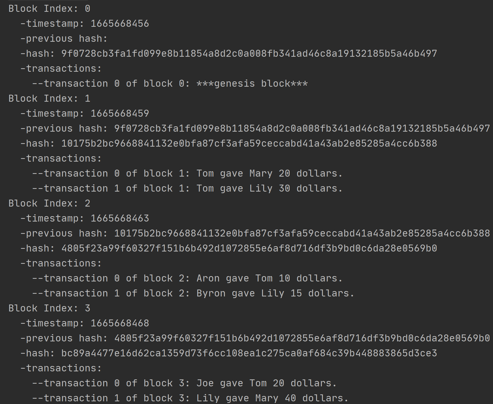

# 任务：创建简单的区块链

同学你好，欢迎参加本次区块链方向招新考核测试！在这两天中，你将跟随指引，创建一个简单的区块链系统，并逐步完善它的功能，使它更贴近真实的区块链，以下是一些说明和注意事项：

1.本次测试的全部代码均需要使用**Go语言**完成。

2.请于10月16日23:59前将本次测试的所有代码打包发送至邮箱1565248524@qq.com，压缩包使用你的名字命名。提交截止时间以后不再接受任何代码修改与追加的请求。

3.在区块链技术考核群中有一个在线文档链接（可能会比试题稍晚发送），请在链接中同步你的任务进度。

4.任务分成三个层次：**基础任务**、**进阶任务**和**拓展任务**，你需要首先完成基础任务。进阶任务和拓展任务中的各个小任务整体大致按照难度由低到高排列，完成顺序可以自由调整，但其中部分小任务可能需要前面的任务作为铺垫。

5.请使用Gitee进行代码管理，要求进阶任务和拓展任务的修改在完成基础任务的基础上新建分支进行（即，要有一个分支存储仅完成了基础任务的代码）。如果没有特殊说明，所有进阶任务和拓展任务的修改都可以在同一分支下完成。这个仓库在测试期间可以设为私有，但在测试结束后需要公开（或授权我可查看）并提交仓库链接。

6.加分项：良好的代码习惯，面向对象、协程、接口等语法的**合理**使用，更完备的功能和更好的结果呈现方式，使用tag/release等功能对Gitee仓库代码版本进行清晰直观的管理等等。

不要感到畏惧，愿你度过充实的两天时间！

## 1.基础任务

请阅读`main`和`core`目录下的代码，填写下列3处空白，使得该简易的区块链系统能够正常工作。

### 1.1

位于`core/block.go`，完成下列函数，使得函数能够正常生成新区块，且新区块的结构体中各个字段值正确：

```go
func GenerateNewBlock (previousBlock *Block, transactions []string) *Block {
	block := new(Block)
	/*
		请在此补全代码
	*/
	return block
}
```

### 1.2

同样位于`core/block.go`，完成下列函数，使得函数能够正常将一个区块进行哈希散列运算，返回64位哈希值：

```go
func CalculateHash (b *Block) string {
	var hashValue string
	/*
		请在此补全代码
	*/
	return hashValue
}
```

哈希散列运算：要求不同的输入映射成独一无二的、固定长度的值，且基本不发生哈希碰撞。

### 1.3

位于`core/blockchain.go`，完成下列方法，使得函数能够正常打印出区块链中所有交易历史：

```go
func (bc *Blockchain) Print() {
	/*
		请在此补全代码
	 */
}
```

### 检验

上述三处填补完成后，运行`main/main.go`，使得最终显示效果类似下图：




至此，一个简单的区块链系统搭建完成。


## 2.进阶任务

### 2.1 Merkle Tree

将1.2中所陈述的函数中的普通散列运算，修改为真实区块链中常用的Merkle树散列运算。

### 2.2 Transaction

真实区块链系统中，交易并不会以示例代码中`"Tom gave Mary 20 dollars."`这样的方式存储。

请添加`*Transaction`结构存储交易，要求其中至少包含三个字段：`From`用来存储交易的发出方，`To`用来存储交易的接受方，`Value`用来存储交易值。然后用此结构替换程序中的交易。

### 2.3 Account

**请在完成任务2.2后再开始此任务**

区块链中还存在着许多”账户（Account）“，也就对应着示例中的“Tom”“Mary”等。每个账户有一个独一无二的标识，代替了“Tom”“Mary”这些名字，这个标识就是账户的“地址（Address）”，它通常是一段十六进制的字符串。2.2中“From”和“To”字段的内容也应是账户的地址。

请添加结构存储账户，要求其中至少包含两个字段：账户的地址和余额（Balance）。给交易中出现的每个人名分配一个账户，地址可以自由指定，余额设置成100。改写对应的函数和方法，要注意在交易**最终被提交到区块链上**时，发出方和接受方的余额也要进行相应变动。创建一个列表，存储系统中所有账户地址，然后，添加一个输出世界状态函数，输出世界状态。“世界状态”就是经过目前已提交到区块链上的所有交易后，各账户的余额。

### 2.4 Timeout

该工程中当收集到的交易达到一定数量时才会产生一个新区块，但是在真实场景中还有一种产生新区块的机制：超时。

设定一个超时计时器，在每次生成新区块时重置，当该计时器耗尽时，就算待提交的交易数量不够甚至为零，也生成一个新区块提交到链上。为了更好地展现超时机制效果，你可以适当添加`main/main.go`中的示例交易、更改交易间等待的时间和区块最大交易数量，也可以更改程序结构使在生成新区块时就输出区块信息。

### 2.5 Network

使你的简易区块链系统可以通过网络通信的方式接收其他设备发送的交易信息。另建一个工程，将区块链系统`main/main.go`中的交易信息移动至此新建工程中对外发送。在你的电脑上同时运行两个工程，让区块链系统能够接收到交易信息并正常处理。

**注意：此任务的代码请新建分支保存，拓展任务也不需要在此任务代码上修改。换句话说，如果此时你已完成进阶任务，拓展任务只需在完成进阶任务2.1~2.4的代码上继续修改即可。**


## 3.拓展任务

### 3.1 Distributed

真实的区块链系统是分布式、去中心化的，请为你的区块链系统添加通过网络通信与其他同步状态的功能，运行多个进程，使它们能够互相收发数据、同步交易和区块链状态。

注意此任务与2.5的区别，任务2.5仅要求实现使区块链系统接收交易数据的功能，而负责发送数据的是一个独立编写的仅负责发送数据的进程；此任务则是要让几个进程都运行你的**同一份**工程代码（为了测试需要可以适当修改产生交易的内容，但核心代码需要相同），并实现数据的同步。

此后的任务均依托此任务进行，**去中心化**这一要求也将一直存在。

### 3.2 Console

**请在完成任务2.2、2.3、3.1后再开始此任务**

区块链系统中，交易的产生当然不该是像我们的示例一样写在代码中的，而是要由各个终端发送。

在任务3.1的基础上，使每个进程控制一个账户，并使终端交互界面成为一个简易控制台，将登录账户、查询区块信息、查询世界状态、向指定账户发送指定额交易等功能作为控制台的指令。

### 3.3 Mining

**请在完成任务3.2后再开始此任务**

很多实际区块链上的区块都是由挖矿（mining）产生的，这背后其实是一套共识（consensus）机制。请你在控制台中添加开始挖矿和停止挖矿的功能；为区块添加`coinbase`字段，记录挖出这个区块的账户，并在区块被挖出时给这个账户一定量的代币（token）作为奖励；在生成一个新区块时，如果有进程正在挖矿，设计某种方式唯一确定这个区块被哪个账户挖出，并使这个结果和对应的代币奖励能被所有进程共同承认。

### 3.4 Consensus

**请在完成任务3.3后再开始此任务**

思考：在任务3.1中，如果两个甚至多个进程几乎同时提交了一笔交易，并且由于网络延迟，它们都认为自己是较先提交的那一方，应该怎么处理？在任务3.3中，你设计的方式在网络延迟不可忽略不计的情况下还能稳定工作吗？这种方式防止投机取巧和抵御恶意攻击的效果如何？

学习一套主流的共识算法（例如PoW或PoS），并将它应用到你的系统中。


恭喜你！完成全部任务后，你的区块链网络应已具有基本完备的基础功能。虽然真实的区块链项目往往仍要复杂许多倍，但相信你有勇气和兴趣迎接更困难的挑战。

